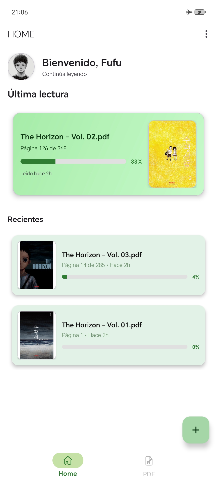

# PDFTOON v5.0.0

Una aplicación moderna de lectura de PDF para Android con interfaz tipo "biblioteca digital", historial persistente y modo de lectura inmersivo.

## 📱 Capturas de Pantalla

<p align="center">
  
</p>

## � ¿Qué hay de nuevo en 5.0.0?

### 🎨 Visor de PDF con Interfaz Elegante
- **Toolbar con degradado semitransparente**: Apariencia moderna y sofisticada en la parte superior
- **Controles inferiores con degradado**: Barra de progreso con fondo degradado elegante
- **Indicador lateral interactivo**: Arrastra el indicador para navegar rápidamente por el PDF
- **Animaciones elegantes**: El indicador se agranda al tocarlo con efecto de rebote al soltarlo
- **Barra de progreso con cambio de color dinámico**: 
  - Azul (0-79%): Color normal
  - Naranja (80-89%): Transición suave a naranja cuando te acercas al final
  - Rojo (90-100%): Degradado rojo intenso para indicar que estás terminando el documento

### 🌍 Internacionalización Completa
- **Soporte completo de i18n**: Todos los textos de la interfaz ahora soportan español e inglés
- **Cambio automático de idioma**: La aplicación se adapta automáticamente a la configuración del sistema
- **Mejora de la accesibilidad y consistencia**

## ✨ Características Principales de 5.0.0

### 🏠 Nueva Pantalla de Inicio Rediseñada
- **Tarjeta destacada de última lectura**: Muestra el último PDF abierto con vista previa, progreso visual y acceso rápido
- **Saludo personalizado**: Mensaje de bienvenida dinámico en la pantalla principal
- **Sección de recientes**: Lista compacta de PDFs recientes con acceso directo
- **Estado vacío mejorado**: Indicaciones claras cuando no hay PDFs en el historial
- **Diseño Material You**: Tarjetas con bordes redondeados (16dp), elevación sutil y degradados modernos

### 📱 Compatibilidad Android 15 y Dispositivos de 16 KB
- **Soporte completo para páginas de 16 KB**: Cumple con los requisitos de Google Play (obligatorio desde Nov 2025)
- **NDK r27 actualizado**: Garantiza compatibilidad con Pixel 9 y dispositivos ARM v9+
- **Optimización de librerías nativas**: Todas las bibliotecas .so correctamente alineadas

### 📖 Visor de PDF Rediseñado
- **Modo de lectura inmersivo**: Los controles se ocultan automáticamente tras 2.5 segundos de inactividad
- **Navegación vertical**: Desplazamiento continuo por el documento (sin toques laterales para cambiar página)
- **Controles minimalistas**: Barra superior translúcida que aparece/desaparece con un toque
- **Bloqueo de rotación**: Orientación vertical por defecto para lectura cómoda
- **Doble toque para zoom**: Alterna entre ajuste de ancho y zoom 150%

### 📚 Sistema de Historial Avanzado
- **Posición exacta guardada**: Guarda no solo la página, sino el scroll exacto dentro de la página
- **Reanudar lectura**: Al reabrir cualquier PDF, continúa exactamente donde lo dejaste
- **Metadata completa**: Fecha de última lectura, progreso porcentual, páginas totales
- **Favoritos**: Marca tus PDFs importantes para acceso rápido
- **Gestión de historial**: Borra entradas individuales o limpia todo el historial

### 💾 Privacidad y Exportación
- **Datos 100% locales**: Todo se guarda en tu dispositivo, sin telemetría
- **Exportar/Importar historial**: Respalda tu progreso de lectura en formato JSON
- **Accesibilidad inteligente**: La app detecta si un archivo ha sido movido o eliminado

### 🎨 Interfaz Material You
- Fondo (claro): degradado verde de #C8FACC a #A6ECA8
- Componentes en blanco/verde con bordes ≥16dp y espaciado 12–24dp
- AppBar con icono de inicio y opciones; barra de búsqueda prominente
- FAB "Agregar PDF" con iconografía vectorial minimalista

### 🌓 Tema claro / oscuro
- Preferencia persistente entre sesiones
- Claro: degradado verde; Oscuro: fondo negro (near-black) con texto de alto contraste
- Iconos de status bar ajustados según el modo para legibilidad

## ✨ Características Principales

### Visor de PDF
- **Controles auto-ocultables**: Interfaz limpia que desaparece automáticamente
- **Scroll vertical continuo**: Navegación natural página por página
- **Guardado automático de progreso**: No pierdas nunca tu lugar de lectura
- **Pantalla completa**: Modo inmersivo que mantiene la pantalla encendida
- **Título abreviado**: Muestra el nombre del archivo sin extensión

### Gestión de Archivos
- **Storage Access Framework (SAF)**: Acceso moderno a archivos sin permisos invasivos
- **Compatibilidad Android 10-15**: Funciona en todas las versiones modernas
- **Detección de archivos movidos**: Notificación clara si un archivo cambió de ubicación
- **Búsqueda en tiempo real**: Filtra tu biblioteca instantáneamente

### Historial y Persistencia
- **Base de datos Room**: Almacenamiento robusto y eficiente
- **Último PDF abierto**: Acceso rápido a tu lectura más reciente
- **Progreso visual**: Barra de progreso y porcentaje de lectura
- **Ordenamiento por fecha**: Los más recientes primero

## 📋 Características Técnicas

### Persistencia de Datos
- **Room Database v2**: Con migración automática para nuevos campos
- **Campos guardados por PDF**:
  - URI del archivo
  - Nombre del archivo
  - Página actual
  - Offset de scroll (posición exacta)
  - Fecha de última lectura
  - Total de páginas
  - Ruta del archivo (para recuperación)
  - Estado de accesibilidad
  - Marcador de favorito


## 🛠️ Instalación y uso

### Requisitos
- Android 10 (API 29) o superior
- ~50 MB de espacio libre

### Agregar un PDF
1. Toca el FAB "+" en la esquina inferior derecha
2. Selecciona un PDF usando el selector de archivos del sistema
3. El PDF se añade automáticamente a tu biblioteca

### Leer un PDF
1. Toca cualquier PDF de tu biblioteca
2. Lee con scroll vertical natural
3. Toca la pantalla para mostrar/ocultar controles
4. Doble toque para hacer zoom
5. Tu progreso se guarda automáticamente al salir

### Gestionar Historial
- **Ver historial**: Navega a la pestaña "Historial" en la barra inferior
- **Borrar entrada**: Mantén pulsado sobre un PDF y selecciona "Eliminar"
- **Limpiar todo**: Usa la opción "Limpiar historial" en el menú
- **Marcar favorito**: Toca el ícono de estrella en el visor

### Exportar/Importar Historial
1. Ve a Ajustes → Historial
2. "Exportar historial" → Elige ubicación para guardar JSON
3. "Importar historial" → Selecciona archivo JSON previamente exportado

## ⚙️ Compilación y firma

### Comandos rápidos
```bash
./gradlew clean assembleRelease -x lint -x test
ls -lh app/build/outputs/apk/release/
```
- Artefacto: `app/build/outputs/apk/release/app-release.apk` (≈31 MB)
- Firma: si `keystore/keystore.properties` existe y es válido, se firma con tu keystore

### Configurar firma (opcional)
1. Copia tu JKS a `keystore/KEYSTORE.jks`
2. Crea `keystore/keystore.properties`:
```properties
storeFile=keystore/KEYSTORE.jks
storePassword=TU_PASSWORD
keyAlias=TU_ALIAS
keyPassword=TU_PASSWORD_ALIAS
```
3. Recompila con `assembleRelease`

## 📦 Optimización del APK
- R8 activado con minificación y eliminación de recursos no usados
- Exclusiones de META-INF para reducir tamaño
- Vector drawables en lugar de PNG
- Tamaño actual: ~31 MB

## 🧩 Arquitectura

### Stack Tecnológico
- **UI**: Material 3, ViewBinding, ConstraintLayout
- **Persistencia**: Room Database, DataStore (preferencias)
- **Arquitectura**: MVVM con LiveData y ViewModel
- **PDF Rendering**: `com.github.barteksc:android-pdf-viewer`
- **Acceso a archivos**: Storage Access Framework (SAF)
- **Lenguaje**: Kotlin 100%


## 🛡️ Privacidad y Seguridad
- ✅ Sin telemetría ni analytics
- ✅ Sin conexión a internet requerida
- ✅ Datos almacenados localmente
- ✅ Exportación cifrable del historial (JSON local)
- ✅ Sin permisos de almacenamiento invasivos (usa SAF)


## 🎯 Roadmap
- [ ] Anotaciones y marcadores en PDF
- [ ] Modo de lectura nocturna con filtro
- [ ] Sincronización en la nube (opcional)
- [ ] Soporte para otros formatos (EPUB, MOBI)
- [ ] Gestos personalizables
- [ ] Temas de color personalizados

## 👨‍💻 Desarrollador
**fufushiro**

PDFTOON v5.0.2 - Lector de PDF moderno y optimizado para Android

## 📄 Licencia
MIT. Ver `LICENSE`.

## 🤝 Contribuciones
Las contribuciones son bienvenidas. Por favor:
1. Fork el proyecto
2. Crea una rama para tu feature (`git checkout -b feature/AmazingFeature`)
3. Commit tus cambios (`git commit -m 'Add some AmazingFeature'`)
4. Push a la rama (`git push origin feature/AmazingFeature`)
5. Abre un Pull Request

## 📧 Soporte
Para reportar bugs o solicitar features, abre un issue en GitHub.

---
**PDFTOON** - Lectura de PDF simple, elegante y privada 📚
